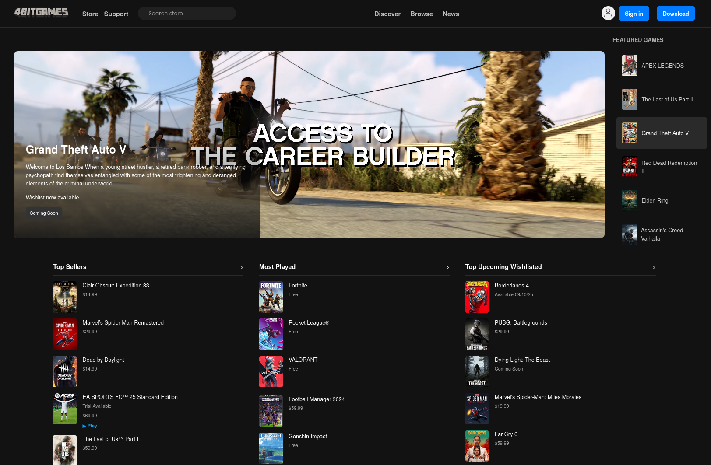
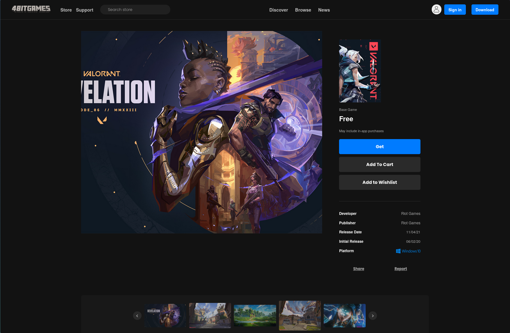

# 4bitgames - Game Store UI Clone

### 🚀 **[Click here for the Live Demo](https://4jib0x.github.io/4bitgames/)**
> **Note:** The only fully functional game page in the live demo is the **Valorant** page.

---

## 🖼️ Project Gallery
<em>The Main Store Page</em>
<p align="center">
  
    
<em>Valorant Game Page with Interactive Gallery</em>
</p>
<p align="center">
  

</p>

---

## 📖 Overview

This project is a front-end clone of a digital game store's UI, inspired by the Epic Games Store. Developed in **March 2025**, it was my first project where I implemented **JavaScript** to add interactive elements.

The project includes a main store page, a product page for a game, as well as login and sign-up pages.

---

## 🤖 The Role of AI in This Project

AI tools (specifically GitHub Copilot) were used to assist with the following tasks:
*   **Project Refactoring:** Completely restructuring the project's files and folders to make it ready for deployment on GitHub Pages.
*   **Gallery Implementation:** Generating the `gallery.js` code responsible for the interactive image gallery on the Valorant game page.
*   **Bug Fixing:** Helping to debug and correct logical errors in other JavaScript files.

---

## ⚠️ Important Notes

*   **UI/UX Demonstration:** This is a static project for demonstration purposes. Most buttons and links are not functional.
*   **Active Game Page:** The **Valorant** page is the only game with a dedicated, functional product page.
*   **Auth Pages:** The project includes templates for both a **Login** and a **Sign up** page.

---

## 🛠️ Technologies Used

*   **HTML5:** For structuring the content.
*   **CSS3:** For styling and layout (including Flexbox and Grid).
*   **JavaScript (ES6):** For client-side interactivity.
*   **AI (GitHub Copilot):** For assistance with refactoring and code generation.

---

### 🔧 How to View

1.  **Live Demo:** The easiest way is to visit the **Live Demo link** at the top of this page.
2.  **Locally:**
    ```bash
    # 1. Clone the repository
    git clone https://github.com/abdou-agiba/4bitgames.git

    # 2. Open the index.html file in your browser
    ```
